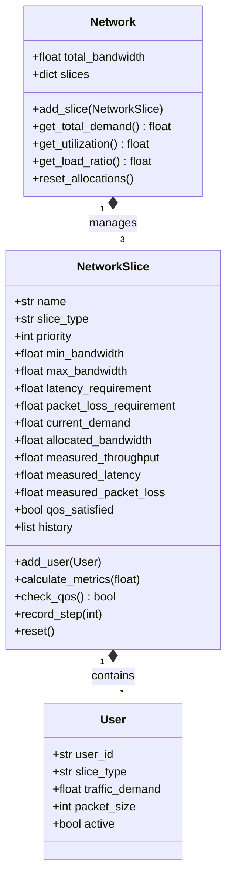

# Module Documentation: `models/`

## 1. Overview
The `models/` module defines the Object-Oriented Domain Entities that represent the physical and logical components of the 5G virtualized network:
*   `User`: End-user devices or sensors generating traffic.
*   `NetworkSlice`: Logical, self-contained virtual networks with dedicated QoS metrics and history.
*   `Network`: The overarching infrastructure holding slices and managing aggregate transmission capacity.

---

## 2. File Deep-Dive

### 2.1. `models/user_model.py` — `User` Class

#### Purpose
Represents individual User Equipment (UE) or IoT devices attached to a specific network slice.

#### Attributes
*   `user_id` (*str*): Unique device identifier (e.g., `'eMBB_user_0'`).
*   `slice_type` (*str*): Associated slice type (`'eMBB'`, `'URLLC'`, or `'mMTC'`).
*   `traffic_demand` (*float*): Average data rate demand in Mbps generated by this user.
*   `packet_size` (*int*): Standard packet payload size in bytes (default: `1500` bytes).
*   `active` (*bool*): Connection state indicator.

---

### 2.2. `models/slice_model.py` — `NetworkSlice` Class

#### Purpose
The fundamental execution unit. Tracks slice demands, holds allocations, computes QoS metrics (throughput, latency, packet loss), evaluates SLA adherence, and records temporal history.

#### Attributes
*   `name` (*str*): Name of the slice (e.g., `'URLLC'`).
*   `slice_type` (*str*): Slicing category identifier.
*   `priority` (*int*): Base priority weighting from config.
*   `min_bandwidth`, `max_bandwidth` (*float*): Physical allocation boundaries in Mbps.
*   `latency_requirement` (*float*): SLA maximum latency threshold in ms.
*   `packet_loss_requirement` (*float*): SLA maximum packet loss threshold in %.
*   `users` (*list[User]*): Registered user objects.
*   `current_demand` (*float*): Instantaneous demand in Mbps for the current second.
*   `allocated_bandwidth` (*float*): Bandwidth assigned by the allocator in Mbps.
*   `measured_throughput` (*float*): Delivered data rate in Mbps.
*   `measured_latency` (*float*): Calculated end-to-end delay in ms.
*   `measured_packet_loss` (*float*): Calculated packet drop rate in %.
*   `qos_satisfied` (*bool*): Boolean flag indicating SLA compliance.
*   `history` (*list[dict]*): Time-series array capturing state at every time step $t$.

#### Methods Breakdown

##### 1. `calculate_metrics(self, network_load_ratio)`
Calculates the physical delivery performance for the current time step:
*   **Throughput:**
    $$\text{measured\_throughput} = \min(\text{current\_demand}, \text{allocated\_bandwidth})$$
*   **Packet Loss:**
    $$\text{measured\_packet\_loss} = \begin{cases} \left(\frac{\text{current\_demand} - \text{allocated\_bandwidth}}{\text{current\_demand}}\right) \times 100 & \text{if demand} > \text{allocation} \\ 0 & \text{otherwise} \end{cases}$$
*   **Latency:**
    $$\text{base\_latency} = \text{BASE\_LATENCY}[\text{self.slice\_type}]$$
    $$\text{load\_delay} = \text{base\_latency} \times (1 + 2.0 \times \text{network\_load\_ratio})$$
    $$\text{congestion\_delay} = \begin{cases} \left(\frac{\text{current\_demand} - \text{allocated\_bandwidth}}{\text{allocated\_bandwidth}}\right) \times 5 & \text{if allocation} > 0 \text{ and demand} > \text{allocation} \\ 0 & \text{otherwise} \end{cases}$$
    $$\text{measured\_latency} = \text{load\_delay} + \text{congestion\_delay}$$

##### 2. `check_qos(self)`
Evaluates SLA compliance against configured limits:
$$\text{qos\_satisfied} = (\text{measured\_latency} \le \text{latency\_requirement}) \land (\text{measured\_packet\_loss} \le \text{packet\_loss\_requirement})$$
Returns `True` if satisfied, `False` if a QoS SLA violation occurred.

##### 3. `record_step(self, time)`
Appends a snapshot dictionary to `self.history` containing `time`, `demand`, `allocated`, `throughput`, `latency`, `packet_loss`, and `qos_satisfied`.

##### 4. `reset(self)`
Restores instantaneous variables to zero while retaining user registrations and configurations.

---

### 2.3. `models/network_model.py` — `Network` Class

#### Purpose
Represents the global 5G network environment and aggregated transmission link.

#### Attributes
*   `total_bandwidth` (*float*): Total infrastructure capacity (e.g., 100 Mbps).
*   `slices` (*dict[str, NetworkSlice]*): Dictionary mapping slice names to `NetworkSlice` objects.

#### Methods Breakdown
*   `add_slice(self, network_slice)`: Adds a slice instance to the internal dictionary.
*   `get_total_demand(self)`: Computes $\sum \text{current\_demand}$ across all slices.
*   `get_utilization(self)`: Computes total allocated percentage:
    $$\text{Utilization} = \left(\frac{\sum \text{allocated\_bandwidth}}{\text{total\_bandwidth}}\right) \times 100$$
*   `get_load_ratio(self)`: Returns normalized load ratio $\rho \in [0.0, 1.0]$:
    $$\rho = \min\left(1.0, \frac{\text{get\_total\_demand}()}{\text{total\_bandwidth}}\right)$$
*   `reset_allocations(self)`: Calls `reset()` on all managed slice instances.

---

## 3. Interaction Diagram

---

## 4. Viva / Defense Preparation Questions
1. **Q:** *Why is latency modeled as a function of total network load rather than just the slice's own traffic?*
   * **A:** In a shared physical 5G RAN / Core transport infrastructure, total traffic across all slices contributes to physical buffer contention and scheduling latency at the base station (gNodeB). Therefore, when eMBB floods the physical channel, URLLC packet queuing increases unless isolated through prioritized resource scheduling.
2. **Q:** *Where is the data stored at each simulation second?*
   * **A:** Each slice maintains an in-memory `history` list of timestamped dictionaries. At the end of the simulation run, `simulator.py` flattens these history dictionaries into a single, unified Pandas `DataFrame`.
