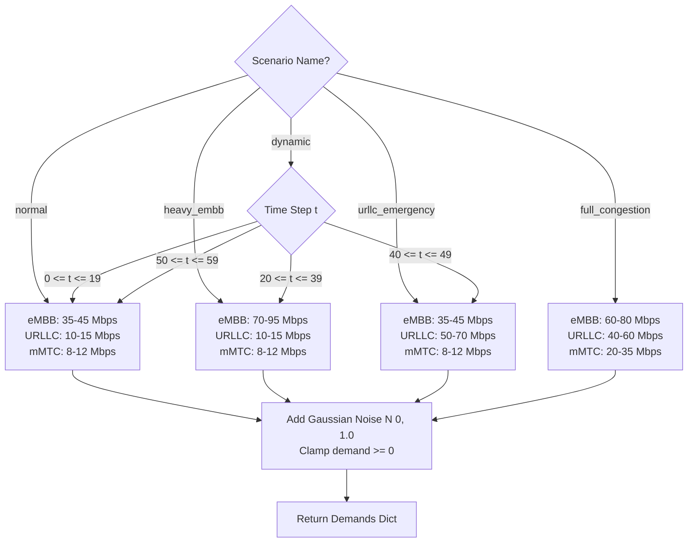

# Module Documentation: `traffic/`

## 1. Overview
The `traffic/` module simulates realistic, time-varying, and non-deterministic user traffic demands across all 5G network slices. It integrates stochastic random number generators with scenario-specific traffic distributions to stress-test resource allocation algorithms.

---

## 2. File Deep-Dive: `traffic/traffic_generator.py`

### 2.1. File Purpose
Generates instantaneous data rate demands (in Mbps) for `eMBB`, `URLLC`, and `mMTC` at any given time step $t$ based on the selected operational scenario.

### 2.2. Class: `TrafficGenerator`

#### Initialization
```python
def __init__(self, seed=42):
    self.rng = np.random.RandomState(seed)
```
*   Uses `numpy.random.RandomState(seed)` rather than the global random seed.
*   **Scientific Reproducibility:** Guarantee that all tested algorithms (Static, Round Robin, QoS Adaptive) face identical stochastic traffic traces for fair comparisons.

#### Method: `generate(self, time_step, scenario_name, slices_config)`

##### Input Parameters:
*   `time_step` (*int*): Current simulation clock tick ($t \in [0, \text{duration}-1]$).
*   `scenario_name` (*str*): The active scenario name (`'normal'`, `'heavy_embb'`, `'urllc_emergency'`, `'full_congestion'`, or `'dynamic'`).
*   `slices_config` (*dict*): Configuration metadata from `config.py`.

##### Returns:
*   `demands` (*dict[str, float]*): Dictionary mapping slice type to generated demand in Mbps.

---

## 3. Traffic Scenarios & Numerical Distributions



### 3.1. Detailed Scenario Characteristics

| Scenario | eMBB Range (Mbps) | URLLC Range (Mbps) | mMTC Range (Mbps) | Total Mean Demand | System State |
|---|---|---|---|---|---|
| **Normal** | $35 - 45$ | $10 - 15$ | $8 - 12$ | $\approx 62.5\text{ Mbps}$ | Under-loaded ($<100\text{ Mbps}$) |
| **Heavy eMBB** | $70 - 95$ | $10 - 15$ | $8 - 12$ | $\approx 105\text{ Mbps}$ | eMBB saturation / Contention |
| **URLLC Emergency** | $35 - 45$ | $50 - 70$ | $8 - 12$ | $\approx 110\text{ Mbps}$ | Critical latency breach risk |
| **Full Congestion** | $60 - 80$ | $40 - 60$ | $20 - 35$ | $\approx 147.5\text{ Mbps}$ | Severe overload ($>140\%$ capacity) |
| **Dynamic** | Time-varying | Time-varying | Time-varying | Shifts over time | Demonstrates adaptation over $60\text{s}$ |

### 3.2. Stochastic Perturbation (Gaussian Noise)
To eliminate artificial step-functions, every generated demand is perturbed with continuous zero-mean Gaussian jitter:
$$D_i(t) = \max\left(0, D_i^{\text{uniform}}(t) + \mathcal{N}(\mu=0, \sigma=1.0)\right)$$

---

## 4. Viva / Defense Preparation Questions
1. **Q:** *Why is the dynamic scenario structured with phases (0-19s, 20-39s, 40-49s, 50-59s)?*
   * **A:** This showcases how an algorithm transitions between equilibrium, sudden non-critical congestion (heavy video streaming), sudden life-critical emergency surges (autonomous vehicle collision alerts), and network recovery. It demonstrates resilience under dynamic operational shocks.
2. **Q:** *Why did you use a fixed random seed (42)?*
   * **A:** Controlled experimentation requires eliminating confounding variables. By setting a fixed seed, Static, Round Robin, and QoS Adaptive are evaluated against the exact same millisecond-by-millisecond packet demands.
